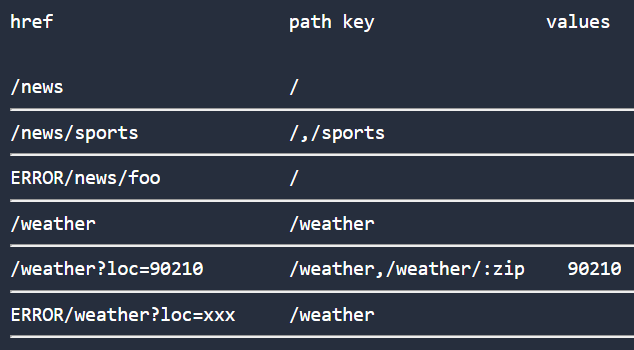

## `npm i ultra`

### Quick 5-minute Intro

Imagine we're tasked to set up routes for a news portal startup. We'll use a rudimentary  navigation structure for the purpose of this exercise.

```
                +----------+
     +----------+   root   +---------+
     |          +----------+         |
     |                               |
     |                               |
+----+-----+                   +-----+----+
| weather  |                +--+   news   +--+
+----------+                |  +----------+  |
                            |                |
                       +----+-----+    +-----+----+
                       | politics |    |  sports  |
                       +----------+    +----------+

```

- Code to setup centralized routing (matching and resolution) as shown below

```javascript

import { spec, match, prefixMatch, container } from 'ultra'

let next = console.log.bind(console), err = console.warn.bind(console)

// when route resolves call next on exact match, err on partial match
// log route result to the console (warn on partial match)

let matchers = [
  match(spec('/weather')(next)), //a
  prefixMatch('/news', match(spec('/', '/politics', '/sports')(next, err))), //b
  match(spec('/')(next)) //c
]

```

Right away you'll notice that ordering matters (like we'd expect in other forms of pattern matching). For example, there's a valid reason why `c` cannot precede `a` or `b`, while `a` or `b` could switch places based on the requirements given to us.

> ✅ Equally important to note that no more than one match ever gets resolved.

The API usage so far consists of three functions: spec, match, and prefixMatch, that are used to build our routing logic.

- _spec_ - accepts path keys + callback functions, returns spec object
  - `fn(...pathKeys) => fn(...callbacks) => object`
  - Order of path keys matters: in `b` for intance, `/` represents the primary path key, whereas `/politics` and `/sports` are secondary and could switch places
  - Position of function arguments is fixed: `0:exact match, 1:partial match, 2:neither`
- _match_ - accepts specs, checks, preMatch callback, returns match object
  - `fn(spec or [...specs], check, preMatch) => object`
  - Provide a spec object or an array of spec objects
  - Latter 2 arguments: check and preMatch will be explored later
- _prefixMatch_ -  accepts a prefix path key, match object, preMatch callback, returns prefix-wrapped match object
  - `fn(prefix, match, preMatch) => object`
  - `/news` path key is used as prefix for the containing match
  - preMatch will be explored later

> ✅ Notice how the route configuration is composed out of small pieces. prefixMatch composes over match and match composes over spec.

Next we'll make a container compose over matches to enable navigation.

- Integrate with browser's PushState API to kickoff routing

```javascript

// run container to begin interacting with the browser
let ultra = container(matchers)

// use ultra to navigate
ultra.push('/news') // resolve: b.next
ultra.push('/news/sports') // resolve: b.next
ultra.push('/news/foo') // resolve: b.err
```

:shipit: That was easy! Although don't hit deploy just yet. The weather route could really use user's location to provide a better experience. The challenge is to figure out how to map query string `?loc=<zip>` to the weather route.

- Treat query string and hash fragments integral to routing as shown below

```JavaScript
import { check, parseQS, prependPath } from 'ultra'

// add :zip identifier to our path key
let weatherSpec = spec('/weather','/weather/:zip')(next, err)

// validate value of identifier with check
let zipCheck = check(':zip')(/^[0-9]{5}$/) //allow 5 digits

// extract loc value from query string and append to path
let addZip = ({qs, path}) => qs ? prependPath(parseQS(qs, ['loc']), path) : path

let weatherMatch = match(weatherSpec, zipCheck, addZip) //a*

// clone container: replace match (a -> a*), replace ultra object
ultra = container([weatherMatch, ...ultra.matchers.slice(1)], null, ultra)

// navigate
ultra.push('/weather') //resolve: a*.next

// assume query param loc is set externally
ultra.push('/weather?loc=90210') //resolve: a*.next with :zip = 90210
ultra.push('/weather?loc=abc') //resolve: a*.err
```

We were able to accomplish 3 critical tasks here:
- Create a new match for `/weather` and `/weather/:zip`
- Extract value of `:zip` from query string and validate
- Update our container with the new matchers

Notice the call to match: `match(weatherSpec, zipCheck, addZip) //a*`
- addZip is our preMatch callback function that's invoked before the specs
- zipCheck, a regexp literal, provides validation to determine match

Finally a dry-run of our ~~hard~~ work should produce a similar result.

- News portal navigation log



### Test-drive
- [JavaScript](https://jsfiddle.net/cheekyiscool/ktdmwx0o/embedded/js,html,css,result/dark/) (ctrl-click to open in JSFiddle)
- [React](http://jsfiddle.net/cheekyiscool/4wpt096z/embedded/js,html,css,result/dark/)

> ✅ Routing code is reused in these examples. Generally a good measure to suggest that the abstraction hit a sweet spot!

This is true, in part because component-based design afforded us this level of  flexibility: choosing how micro or macro you want your module to be.

> We're often not seeking for more power. We're seeking for more principled ways of using our existing power.

Quote from one of my favorite React talks by Cheng Lou: [The Spectrum of Abstraction](https://www.youtube.com/watch?v=mVVNJKv9esE) _#throwback_


### USP
- Embrace component paradigm, stay framework agnostic
  - Use conventions to map url string to component (sub)trees
  - Independent of rendering or view layer
    - Routing should be immune to complexity introduced by framework-level abstractions (context in React for e.g.)
- Co-locate routes to support scalability
  - Routes are data. Similar types of information are best understood if they exist in the same space.
  - On the other end, as relationships between components get more complex, it is best to leave route matching logic out of the mix.
- Extensible
  - Composable API provides clear separation between route configuration and runtime to avail maximum reuse and target different environments
- Compact
  - Ideal for mobile/progressive web apps
    - No runtime dependencies
    - `4.6 kb > ultra (> preact)`
    - Code splitting friendly

### Trade-offs
  - For modern browsers with pushstate support
  - Does not render component or fetch data
    - `<elaborate>`
  - Relies on use of path keys (strings) to derive result
    - More complex update process involves replacing path keys throughout the app
    - Path keys (non-minified) may contribute to bloated bundles
      - Concern for apps with _multiple_ deeply nested routes, e.g. Amazon
  - For the Developer: Overcome the notion of changing your routing code again this season, and actually following through. No pun intended.

### Resources

- Code Examples (React)
  - Vehicle shop: [jsfiddle](http://jsfiddle.net/cheekyiscool/1n7v87aq/embedded/js,html,result/dark/), [source](https://github.com/gt3/ultra-react/tree/master/examples/01.carshop)

### License

MIT

---

> Handle a route or two without breaking a sweat. :crossed_swords: `ULTRA`
