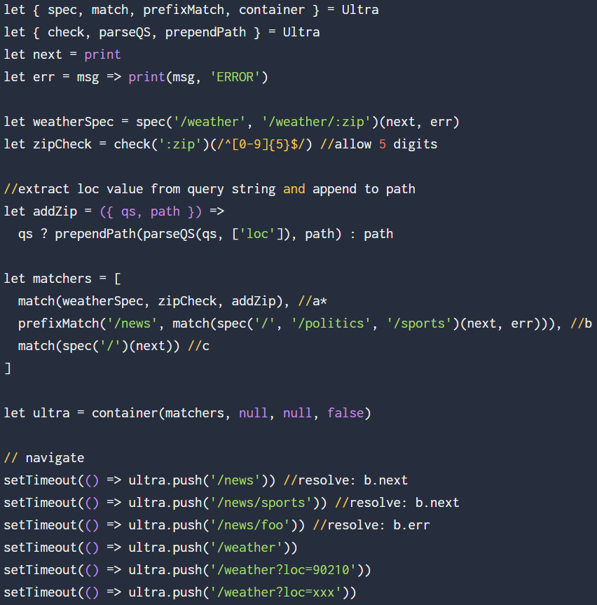

## `npm i --save ultra`

## Quick Intro
- Setup centralized routing (matching and resolution) for a news portal
```JavaScript
import { spec, match, prefixMatch, container } from 'ultra'

let next = console.log.bind(console), err = console.warn.bind(console)

//call next on exact match, err on partial match

let matchers = [
  match(spec('/weather')(next)), //a
  prefixMatch('/news', match(spec('/', '/politics', '/sports')(next, err))), //b
  match(spec('/')(next)) //c
]
```

- Integrate with browser's PushState API to kickoff routing

```JavaScript
let ultra = container(matchers) //run

// ultra points to the router instance, use it to navigate
ultra.push('/news') //resolve: b.next
ultra.push('/news/sports') //resolve: b.next
ultra.push('/news/foo') //resolve: b.err
```
- Treat query string and hash fragments integral to routing

```JavaScript
import { check, parseQS, prependPath } from 'ultra'

//add :zip identifier to our path key
let weatherSpec = spec('/weather','/weather/:zip')(next, err)

//validate value of identifier with check
let zipCheck = check(':zip')(/^[0-9]{5}$/) //allow 5 digits

//extract loc value from query string and append to path
let addZip = ({qs, path}) => qs ? prependPath(parseQS(qs, ['loc']), path) : path

//new matchers (a* replaces a in previous code block)
matchers = [
  match(weatherSpec, zipCheck, addZip) //a*
  prefixMatch('/news', match(spec('/', '/politics', '/sports')(next, err))), //b
  match(spec('/')(next)) //c
]

//clone container by passing new matchers and current running instance
ultra = container(matchers, null, ultra)

//navigate
ultra.push('/weather') //resolve: a*.next

//assume query param loc is set externally
ultra.push('/weather?loc=90210') //resolve: a*.next with :zip = 90210
ultra.push('/weather?loc=abc') //resolve: a*.err
```

## Test-drive
- [Vanilla JS](https://jsfiddle.net/cheekyiscool/ktdmwx0o/embedded/js,html,css,result/dark/) (ctrl-click to open in JSFiddle)
- [React](http://jsfiddle.net/cheekyiscool/4wpt096z/embedded/js,html,css,result/dark/)
- Vue.js example coming soon...

> ✅ Routing code is reused in these examples. Generally a good measure to suggest that the abstraction hit a sweet spot!

This is true, in part because component-based design afforded us this level of  flexibility: choosing how micro or macro you want your module to be.

> We're often not seeking for more power. We're seeking for more principled ways of using our existing power.

Quote from one of my favorite React talks by Cheng Lou: [The Spectrum of Abstraction](https://www.youtube.com/watch?v=mVVNJKv9esE) _#throwback_





## USP
- Framework agnostic
  - Independent of rendering or view layer
  - Built for React, Preact, et al., but adaptable for Vue.js, Polymer, Angular oob
- Compliments component-based architecture
  - Use conventions to map url string to component (sub)trees
- Extensible and Compact
  - Composable API provides clear separation between route configuration and runtime to avail maximum reuse and target different environments  
  - Ideal for progressive web apps
    - No runtime dependencies
    - 5k > ultra (> preact)
    - Code splitting friendly


## Trade-offs
  - For modern browsers with pushstate support
  - Does not render component or fetch data
  - Relies on use of path keys (strings) to derive result
    - might require more effort to make a change in app's url structure
    - Path keys (non-minified) may contribute to bloated bundles
      - especially true for apps with _multiple_ deeply nested routes, e.g. Amazon
  - Return to centralized routing configuration for React folks (_ymmv_)
  - Use in production - not just yet.

## License

MIT

